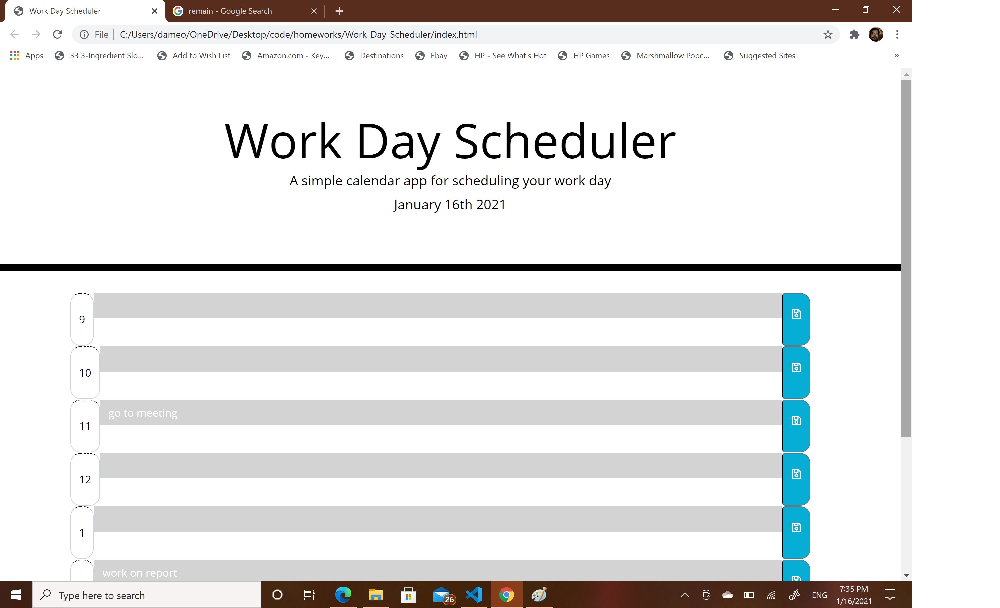

# Work-Day-Scheduler

I want to make a day planer.

- I want to have a the date show on the top of the page.
- I want the time block to be different color based on the time
- Show time block for standard business hours
- When I click on time block allows me to enter an event.
- I want to save event into local storage.
- When I refresh the page the saved events remain
  
